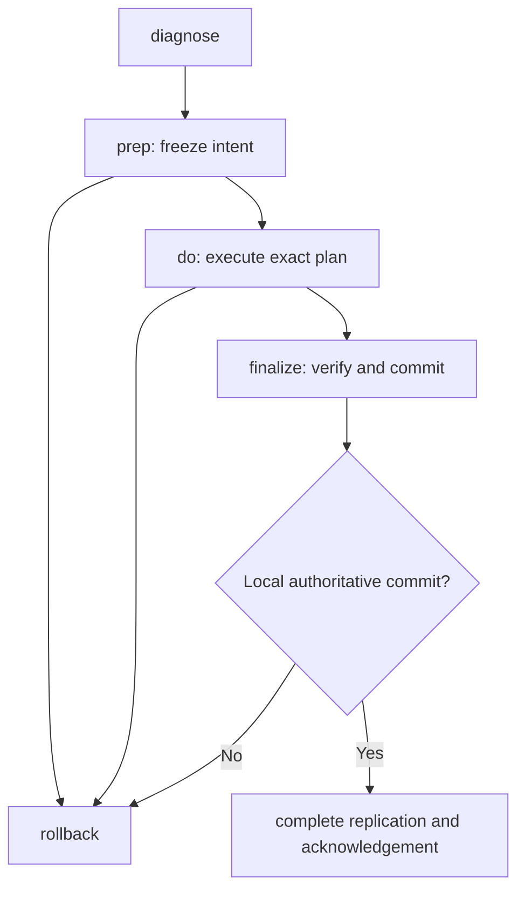

# Mother operator surface

Status: operator-facing companion to `mother.md`

Source reviewed: `mother.md` SHA-256
`0225a462af56e196fc3b88d37466e032434d45fb1b0e7637624ccd8939d2f530`

## 1. Purpose and authority

This document is the top-level catalog of actions an operator can ask Mother to
perform. It explains which operation to choose, the stages the operator drives,
the safety boundary, and the expected outcome.

`mother.md` remains the authority for journal, replica, certificate, recovery,
rollback, and implementation semantics. If this document conflicts with
`mother.md`, `mother.md` governs.

The command examples use:

```text
mother
```

as shorthand for:

```text
python tools/mother/mother.py
```

Some actions are required by `mother.md` even though their final CLI spelling is
not frozen. Those actions are included and explicitly marked. An implementation
MUST NOT omit an action merely because its command name remains to be selected.

## 2. Operator model

There are three kinds of operator action:

| Kind | Meaning | Lifecycle |
|---|---|---|
| Read-only observation | Inspect or plan without changing authoritative or live state | One shot |
| Authoritative staged operation | Change topology, authority, membership, durable state, or a governed service | `prep` → `do` → `finalize`, with `rollback` before commit |
| Non-authoritative maintenance | Rebuild derived local output from an unchanged authoritative head | One shot |

The normal lifecycle is:



The key rules are:

1. `diagnose` is always read-only and is available in every operation state.
2. `prep` is the only stage that interprets operator intent.
3. `do` executes the frozen plan; it does not reinterpret or widen it.
4. `finalize` verifies the result before committing it as authoritative.
5. `rollback` is available only before the operation's irreversible commit.
6. After an ordinary local finalization commit, rollback is closed even if
   remote replication or acknowledgement is still pending.
7. A post-commit interruption is completed by retrying the exact same
   `finalize`; it is not undone by rollback.
8. `repair-projections` is the sole one-shot mutating-maintenance exception. It
   changes only derived local projections.

## 3. Complete operation catalog

### 3.1 Summary

| Operation ID | Operation | Operator intent | Class | Stages | CLI status |
|---|---|---|---|---|---|
| `MOTHER-OP-DIAGNOSE` | `diagnose` | Explain the current network and operation state | Read-only | One shot | Defined |
| `MOTHER-OP-PLAN` | `plan` | Preview scopes, conflicts, risks, and rollback model | Read-only | One shot; normally inside `prep` | Defined as planner boundary |
| `MOTHER-OP-EVIDENCE-EXPORT` | Evidence inspection/export | Preserve raw evidence when state cannot be interpreted safely | Read-only | One shot | Surface name not frozen |
| `MOTHER-OP-ADD-NODE` | `add-node` | Add or reactivate one complete super-node | Authoritative | `prep` / `do` / `finalize` / generic `rollback` | Defined |
| `MOTHER-OP-REMOVE-NODE` | `remove-node` | Remove one complete super-node | Authoritative | `prep` / `do` / `finalize` / generic `rollback` | Defined |
| `MOTHER-OP-RESTORE-SERVICE` | `restore-service` | Recreate or repair a missing Coolify service without changing consensus membership | Authoritative repair | `prep` / `do` / `finalize` / generic `rollback` | Operation defined; some options not frozen |
| `MOTHER-OP-RESEAL-QBFT` | `reseal-qbft` | Repair QBFT configuration on selected existing services | Authoritative repair | `prep` / `do` / `finalize` / generic `rollback` | Defined |
| `MOTHER-OP-RPC-PROPAGATE` | `rpc-propagate` | Repair a damaged RPC route graph | Authoritative repair | `prep` / `do` / `finalize` / generic `rollback` | Operation and API path defined; CLI options not frozen |
| `MOTHER-OP-SYNC-STATE` | `sync-state` | Adopt an already-authoritative, unanimously agreed remote generation locally | Staged local adoption | `prep` / `do` / `rollback` / `finalize` | Defined |
| `MOTHER-OP-RECOVER-HEAD` | `recover-head` | Reconstruct a lost local Mother state root from unanimous compatible replicas | Authority recovery | `prep` / `do` / `finalize` | Defined; pre-activation abort/rollback remains contract-open |
| `MOTHER-OP-RESEAL-STATE` | `reseal-state` | Restore authority when reachable replicas diverge but a safe common base is provable | Authority recovery | `prep` / `do` / `finalize` / generic `rollback` before commit | Defined |
| `MOTHER-OP-REPLICA-ENROLL` | Ordinary replica enrollment | Enroll a Mother replica host independently of node lifecycle | Authoritative membership | `prep` / `do` / `finalize` / generic `rollback` | Required; standalone CLI name not frozen |
| `MOTHER-OP-REPLICA-RETIRE` | Ordinary replica retirement | Retire a Mother replica host independently of node lifecycle | Authoritative membership | `prep` / `do` / `finalize` / generic `rollback` | Required; standalone CLI name not frozen |
| `MOTHER-OP-SCHEMA-MIGRATION` | Schema migration | Move durable Mother state between explicitly supported schema versions | Authoritative migration | Journaled staged operation | Contract-open; mutating entry points disabled |
| `MOTHER-OP-IDENTITY-ROTATION` | Identity or secret rotation | Replace private material after explicit operator intent or loss of trust | Authoritative corrective action | Journaled staged operation | Contract-open; mutating entry points disabled |
| `MOTHER-OP-REPAIR-PROJECTIONS` | `repair-projections` | Rebuild derived local projections from the pinned authoritative local journal | Non-authoritative maintenance | One shot | Operation defined; CLI spelling not frozen |
| `MOTHER-OP-UPGRADE-HUB` | `upgrade-hub` | Roll an immutable signed Hub release across the unchanged authoritative Hub participant set | Authoritative release | `prep` / `do` / `finalize` / generic `rollback` | Defined |
| active operation identity | `rollback` | Reverse an active staged operation before its commit boundary | Lifecycle control | One shot or retry | Defined |
| active operation identity | Retry/resume | Continue the exact active operation after interruption or recognized partial completion | Lifecycle control | Repeat the same `do` or `finalize` | Defined |

The `MOTHER-OP-*` values in this table are the canonical operation IDs used by
`mother-o-f.md`, `mother-o-f-m.md`, tests, evidence, and traceability registries.
Lifecycle controls such as rollback and retry/resume are addressed by active
operation identity rather than a separate `MOTHER-OP-*` catalog entry.

### 3.2 Actions that are not separate top-level operations

The following are phases or states inside another operation, not independent
user workflows:

- validator voting;
- validator admission or removal;
- service deployment inside `add-node`;
- RPC route publication or withdrawal inside node lifecycle;
- Hub/FDB publication or withdrawal inside node lifecycle;
- prospective-host readiness and enrollment;
- network birth;
- pending-action creation;
- standby;
- participant acknowledgement, activation, retirement, or reservation release;
- finalization resynchronization after the local commit.

Mother MUST NOT expose a shortcut that bypasses the parent operation's
preconditions, rollback stack, or finalization contract.

## 4. Read-only actions

### 4.1 Diagnose

Use `diagnose` first, after any ambiguous result, and whenever Mother blocks an
operation.

```text
mother diagnose <network>
mother diagnose <network> --show-blocking-replica <host>
```

The report SHOULD identify:

- the local and remote sealed-state classification;
- current and observed service topology;
- guard, runtime, validator, QBFT, RPC, and Hub/FDB facts;
- network-birth, replica-membership, and zero-validator state;
- the active operation ID, kind, state, and owned scopes;
- unresolved provisional and promoted rollback layers;
- successor reservation and cancellation state;
- finalization replication, acknowledgement, and release status;
- blocking or unreachable participants;
- the exact commands currently allowed.

`diagnose` does not refresh, adopt, repair, reseal, stop, start, deploy, vote, or
write authoritative state.

### 4.2 Plan

The planner consumes diagnosis plus proposed intent and calculates affected
scopes, conflicts, risks, target state, and rollback structure.

It is normally an internal part of `prep`. If exposed directly, it remains
read-only:

```text
mother plan <operation> <network> [operation options]
```

This spelling is illustrative; `mother.md` defines the planner boundary but does
not require a public standalone command.

### 4.3 Inspect or export raw evidence

When a required schema or capability is unknown, unsupported, or ambiguous,
Mother MAY permit safe read-only inspection and export of raw evidence while
refusing mutation and authority activation.

The command name is not frozen. The action MUST preserve original bytes and
hashes and MUST NOT guess at unknown fields.

## 5. Node lifecycle operations

### 5.1 Add node

Use `add-node` to add or reactivate one complete super-node. It is a single
distributed action covering service identity, validator membership, RPC
routing, and Hub/FDB topology.

For Mother, a complete super-node is one governed deployment unit containing the
Hub, its private internal RPC surface, Besu, QBFT validator duties, and the
required guard, health, recovery, and durable-state bindings. Mother MUST NOT
offer a separate Hub-only, RPC-only, Besu-only, validator-only, or non-validator
node-creation path. RPC canaries remain client tests against an existing
super-node and are not deployable nodes.

```text
mother add-node prep <network> \
  --node <service> \
  --host <host> \
  --mode initial|reactivate|soft|hard

mother add-node do <network> [--operation-id <id>]
mother add-node finalize <network> [--operation-id <id>]
mother rollback <network> --all [--operation-id <id>]
```

If the target host is not already a replica, the same action prospectively
enrolls it. The host has readiness duties but no predecessor authority until
membership finalization.

`add-node` includes, in order:

1. reserve and install the intended service and validator identity;
2. create or repair the service as a healthy private candidate;
3. establish the prepared validator set;
4. publish eligible RPC routing;
5. publish the Hub/FDB topology;
6. verify the whole distributed result;
7. finalize the pending action and complete replica acknowledgement.

It MUST NOT invent a validator identity at runtime, publish RPC before validator
admission, or create hidden secondary topology operations.

#### Add modes

| Mode | Use when | Consensus behavior |
|---|---|---|
| `initial` | No committed network-birth record exists | Creates the first born-network checkpoint and first validator from Mother-owned identity/genesis material |
| `reactivate` | The network is born and the finalized validator set is empty | Reuses the existing birth identity, genesis, lineage, private state, and replicas |
| `soft` | The current QBFT network is healthy | Uses live QBFT voting while the chain continues |
| `hard` | Explicit offline topology maintenance or drift repair is required | Quiesces selected validators, writes identical in-place QBFT topology, restarts, and verifies |

`hard` is not permission to delete or recreate unrelated services, rebuild
images, replace compose, or change validator keys.

#### Compatibility aliases

`add-validator` MAY exist only as an alias to the complete `add-node` engine. It
MUST NOT create a validator-only partial workflow when service, RPC, or Hub/FDB
state is affected.

### 5.2 Remove node

Use `remove-node` to remove one complete super-node in dependency-safe order.

```text
mother remove-node prep <network> \
  --node <service> \
  --mode soft|hard \
  [--allow-zero-validators]

mother remove-node do <network> [--operation-id <id>]
mother remove-node finalize <network> [--operation-id <id>]
mother rollback <network> --all [--operation-id <id>]
```

`remove-node` includes, in order:

1. withdraw the target from Hub/FDB topology;
2. withdraw the target from RPC routing;
3. remove it from the validator set;
4. detach, disable, archive, or remove the service exactly as prepared;
5. verify the surviving network;
6. finalize the pending action and complete replica acknowledgement.

Removing the last validator requires `--allow-zero-validators`. A zero-validator
network remains born and retains its identity, genesis, lineage, private state,
recovery closure, and replica set.

Removing a host's last node does **not** de-enroll the host from Mother's replica
set. Replica retirement is a separate authority operation.

`remove-validator` MAY exist only as an alias to the complete `remove-node`
engine.

## 6. Service, consensus, and route repair

### 6.1 Restore service

Use `restore-service` when a Coolify service is missing or damaged but the
saved service identity, volume, and key expectations remain authoritative.

```text
mother restore-service prep <network> --node <service>
mother restore-service do <network> [--operation-id <id>]
mother restore-service finalize <network> [--operation-id <id>]
mother rollback <network> --all [--operation-id <id>]
```

The exact option set is not fully frozen in `mother.md`.

`restore-service` repairs the service only. It MUST NOT:

- change QBFT membership;
- reseal genesis;
- run live add/remove votes;
- infer validator identity from the service name;
- delete pre-existing volumes unless the prepared prestate proves the operation
  created them.

Use `add-node` when a node MUST be admitted to topology, and `reseal-qbft` when
the service exists but QBFT configuration is the damaged layer.

### 6.2 Reseal QBFT

Use `reseal-qbft` for explicit offline, in-place QBFT topology repair across
selected existing services.

```text
mother reseal-qbft prep <network> \
  --nodes <service-a>,<service-b>[,<service-n>]

mother reseal-qbft do <network> [--operation-id <id>]
mother reseal-qbft finalize <network> [--operation-id <id>]
mother rollback <network> --all [--operation-id <id>]
```

It stops only the selected validator subprocesses, backs up their captured
prestate, writes identical prepared QBFT configuration, clears only captured
stale markers, restarts, and verifies the complete selected set.

It MUST NOT delete or recreate Coolify services, rebuild images, replace
compose, change service names or validator keys, use live voting, or invoke
add/remove helpers.

Do not confuse `reseal-qbft` with `reseal-state`:

| Operation | Repairs |
|---|---|
| `reseal-qbft` | Live validator configuration on existing services |
| `reseal-state` | Mother authority and replicated state lineage |

### 6.3 Repair RPC routing

Use explicit route repair only when the RPC route graph is damaged independently
of an otherwise successful node lifecycle.

`mother.md` names the operation `rpc-propagate` and defines its prep API, but
does not freeze the full CLI option set. The intended staged shape is:

```text
mother rpc-propagate prep <network> [route-repair options]
mother rpc-propagate do <network> [--operation-id <id>]
mother rpc-propagate finalize <network> [--operation-id <id>]
mother rollback <network> --all [--operation-id <id>]
```

This operation uses typed route prestate and the ordinary rollback contract. It
is a repair path, not a required follow-up to `add-node` or `remove-node`.

## 7. Replicated-state and authority recovery

### 7.1 Choose the recovery operation

| Diagnosis | Correct action |
|---|---|
| Local and all expected replicas agree | Proceed with the intended normal operation |
| Local state is stale; every expected replica unanimously agrees on a newer compatible generation | `sync-state` |
| Local Mother state root or head is lost; every expected replica unanimously agrees on a complete compatible closure | `recover-head` |
| Every base-authority replica is reachable, reports differ, and a common authority base plus replay-valid predecessor can be proven | `reseal-state` |
| Journal authority is valid; only local derived projections differ | `repair-projections` |
| A required base-authority replica is unreachable | Block, restore reachability, then diagnose again |
| No provable common authority base or replay-valid predecessor exists | Block; do not choose a winner |

Mother does not use majority, “first host to answer,” newest timestamp, or
highest observed generation as authority.

### 7.2 Sync state

Use `sync-state` only to make the local machine adopt an already-authoritative
generation on which every expected replica agrees.

```text
mother sync-state prep <network> \
  --from-authoritative-head <head-hash> \
  [--host <host>]

mother sync-state do <network> [--operation-id <id>]
mother sync-state rollback <network> [--operation-id <id>]
mother sync-state finalize <network> [--operation-id <id>]
```

The stages mean:

- `prep`: pin the current local generation and the unanimously agreed remote
  candidate without changing the active pointer;
- `do`: download, replay, verify, and fully persist the candidate in staging;
- `rollback`: discard staging and leave the prior local pointer untouched;
- `finalize`: atomically switch the local active-generation pointer to the
  verified candidate.

The pointer switch is irreversible. If a crash or timeout occurs:

- old pointer active: retry `finalize` or roll back;
- candidate pointer active: rollback is closed; reconcile forward to committed.

`sync-state` preserves head identity, head epoch, journal sequence, entry and
bundle hashes, and lineage. It does not select a lineage, create authority, or
change topology.

### 7.3 Recover head

Use `recover-head` when the local Mother state root or active head is lost or
unprovable and every expected replica unanimously agrees on one complete
compatible recovery closure.

```text
mother recover-head prep <network> \
  --descriptor <recovery-descriptor.json>

mother recover-head do <network> [--operation-id <id>]
mother recover-head finalize <network> \
  --reason "<operator reason>" \
  [--operation-id <id>]
```

The descriptor supplies non-secret network identity and expected host
references. Coolify credentials are supplied separately and are not recovered
from replicas.

`prep` is read-only against authoritative replica state and requires every
expected replica to be reachable and exactly compatible. `do` reconstructs the
complete local state root, including private state, journals, checkpoints,
pending actions, rollback rights, immutable objects, and authority metadata.
`finalize` activates a new head identity and epoch only after full verification
and full-set acknowledgement.

Recovery preserves an unfinished action as unfinished. It does not silently
retry, finalize, abandon, or roll it back.

Use `sync-state`, not `recover-head`, when the local state root is healthy but
merely stale.

### 7.4 Reseal state

Use `reseal-state` when all base-authority replicas are reachable but Mother
authority is divergent, corrupt, or wedged, and a safe common authority base
plus replay-valid selected predecessor can be proven.

```text
mother reseal-state prep <network> \
  --select-predecessor-head <entry-hash>:<bundle-hash> \
  --reason "<operator reason>" \
  [--include-host <host>] \
  [--exclude-host <host>]

mother reseal-state do <network> [--operation-id <id>]
mother reseal-state finalize <network> [--operation-id <id>]
mother rollback <network> --all [--operation-id <id>]
```

Every base-authority replica MUST accept exactly one authority-reset proposal.
The operation retains displaced divergent heads as forensic evidence and
separately preserves, carries forward, or blocks on every pending action,
reservation, cancellation state, rollback right, and finalization obligation.

`--include-host` and `--exclude-host` are valid only when membership change is
composed into an authority-divergence repair and the complete membership
protocol is satisfied. They are not a shortcut around ordinary replica
membership authority.

Rollback is available only before the new entry-and-authorization-bundle head
is atomically committed. After that pointer commit, the operation completes
forward. An unreachable base-authority replica blocks reseal and cannot be
excluded by the remaining replicas.

## 8. Replica membership operations

Replica membership is independent of node and validator membership.

### 8.1 Enrollment

Adding a node on a new host automatically composes prospective-host enrollment
into `add-node`. The new host is staged, locked, verified, and accepted before
it becomes an active replica.

An ordinary standalone, non-divergent host enrollment is a staged unanimous
membership transition under Mother's normal successor and membership contracts.
`mother.md` requires this operation but does not freeze a direct user CLI name.

### 8.2 Retirement

Removing a node never retires its host as a replica. Retirement requires an
explicit membership-changing operation in which the reachable retiring host
participates through final acknowledgement and records its own retirement.

An unreachable current replica cannot be retired by the remaining hosts under
the safety-first model. Restore it, complete any pending work, and then perform
the membership change.

During an authority-divergence repair, a reachable host MAY be included or
excluded through `reseal-state` only when the operation also satisfies the full
membership-transition contract. Ordinary non-divergent inclusion or retirement
MUST use the ordinary membership path, not authority reseal.

De-enrollment cannot erase private material already copied to a host. If trust
is lost, rotate every identity or secret whose confidentiality can no longer be
proven.

### 8.3 Command-surface requirement

Before implementation freeze, `mother-o.md` SHOULD assign a canonical staged CLI
for ordinary standalone replica inclusion and retirement. The architecture and
safety behavior are already fixed; only the public command spelling and options
remain open.

## 9. Schema migration

Schema migration is an explicit journaled operation. It is required when a new
Mother implementation cannot safely read, replay, restore, verify, and write
every schema needed by the active topology or an unfinished action.

The operation MUST:

- preserve original bytes and hashes for audit;
- declare source and destination schema identifiers;
- run a deterministic validator;
- produce a complete migrated checkpoint or state object;
- replicate and verify the result across the full expected replica set;
- remain rollback-capable until its documented irreversible commit.

Migration MUST NOT occur implicitly during startup, diagnosis, replay, state
sync, or recovery.

`mother.md` does not freeze the CLI name, options, or migration-specific commit
surface. Those MUST be specified before the first migration is implemented.

## 10. Identity and secret rotation

Mother node operations do not delete, regenerate, or rotate private identity
records unless the operator explicitly requests rotation.

Use a separate corrective operation when a host that received private material
is no longer trusted or when confidentiality cannot be proven. Replica
retirement is not sufficient remediation because it cannot erase bytes already
copied to that host.

The corrective action MUST have its own:

- explicit operator intent and affected identity set;
- captured prestate;
- journal and immutable evidence;
- rollback contract;
- post-rotation verification;
- finalization boundary;
- dependent service, contract, or governance reconciliation where applicable.

`mother.md` requires explicit rotation but does not yet define a command name,
wire schema, dependency order, or operation-specific irreversible boundary.
Those are architectural acceptance work before this action can be implemented.
Mother MUST NOT improvise rotation as a side effect of node removal, replica
retirement, diagnosis, recovery, or reseal.

The same rule applies to private-state, contract, or governance assertion
mismatches: Mother reports the evidence and requires an explicit corrective
action; it does not automatically rewrite private state, redeploy contracts, or
submit governance changes merely to make an assertion pass.

## 11. Projection repair

Use `repair-projections` when the authoritative local journal and head are valid
but replay-derived local files are missing, stale, or inconsistent.

Conceptual command:

```text
mother repair-projections <network>
```

The exact CLI spelling is not frozen; the HTTP operation is defined as
`POST /v1/networks/<network>/repair-projections`.

This is a local-only, atomic, idempotent, one-shot maintenance action. It:

1. pins the complete authoritative local head tuple;
2. replays that exact lineage into a new immutable projection generation;
3. verifies every generated file and manifest;
4. rechecks that the authoritative head is unchanged;
5. atomically publishes the entire generation through one pointer.

It does not create an authoritative operation and has no rollback stack. Before
publication, its temporary generation is disposable. It MUST NOT change journal
entries or heads, private state, head authority, finalized or pending topology,
rollback rights, or remote lineage.

It refuses to run while `sync-state`, `recover-head`, or reseal work owns the
local-adoption scope.


## 12. Hub release upgrade

`MOTHER-OP-UPGRADE-HUB` deploys an immutable, prebuilt, signed Hub application
release without changing service identities, Hub/FDB topology, replica or node
membership, schemas, canonical service configuration, identities, or secrets.

Conceptual commands:

```text
mother upgrade-hub prep <network> \
  --release-descriptor <path-or-content-hash> \
  --signature-envelope <path-or-content-hash> \
  [--signer-policy <path-or-content-hash>] \
  [--availability continuous|operator-approved-outage]

mother upgrade-hub do <network> --operation-id <operation-id>
mother upgrade-hub finalize <network> --operation-id <operation-id>
mother rollback <network> --all --operation-id <operation-id>
```

`continuous` is the default. `operator-approved-outage` MUST be explicit during
`prep`; it cannot be added during `do`.

The detached signature envelope is a separate required input. The signer policy
MUST come from already authoritative Mother/network policy or from the explicit
`--signer-policy` input. The release descriptor payload MUST NOT contain or
select its own signature envelope or signer policy. `prep` freezes the validated
policy hash independently from the descriptor-payload hash and detached
signature-envelope hash.

`prep`:

1. proves coherent ordinary D026 authority and an unchanged Hub participant set;
2. resolves the descriptor payload and detached signature envelope, verifies
   their exact signed digest set, and freezes the independently resolved signer
   policy;
3. observes the exact participant-release map and canonical service
   configuration;
4. establishes an explicit operator-accepted legacy rollback baseline when no
   Hub release authority exists;
5. proves unchanged schemas, topology, configuration, identity, secrets, and
   membership plus old/new and mixed-version compatibility;
6. freezes the exact target/rollback closure identities and availability
   receipt contract without staging participants;
7. freezes deterministic rollout order, availability policy, scopes, and
   reverse-order restoration.

`do` opens and replicates the pending action through ordinary D026, stages and
verifies the exact target and rollback closures, and commits an AUTH-020
artifact-availability progress successor before the first live mutation. For
each frozen participant it then captures and arms exact prestate,
drains or gates the service, applies the exact platform digest, reconciles
ambiguous outcomes, verifies the release and mixed-version invariants, restores
eligibility, promotes the rollback frame, and commits a D026 pending-action
progress successor.

`finalize` verifies complete release convergence and commits a typed Hub
component-release delta. It advances only the Hub release generation and
participant-release-map authority. It MUST leave finalized topology and topology
epoch unchanged.

Rollback restores exact captured artifact digests and traffic state in strict
reverse rollout order. A rollback from the first legacy-baseline upgrade leaves
Hub release authority uninitialized.

The operation blocks before live mutation when it would require a topology,
membership, schema, canonical configuration, identity, secret, QBFT, or
permanent route change. It uses neither D028 nor D029 and introduces no new
certificate kind.

## 13. Lifecycle controls

### 13.1 Prep

`prep`:

- runs read-only discovery and classification;
- validates the requested intent;
- freezes current and desired state, participants, scopes, mode, risks, and
  rollback behavior;
- writes the immutable operation record and logical ownership records;
- prints the proposed plan.

It does not perform live infrastructure mutation.

### 13.2 Do

`do`:

- loads the prepared operation;
- revalidates the frozen authority and participants;
- obtains the exact distributed writer authorization;
- creates the replicated pending action before live mutation;
- captures typed prestate before each substep;
- performs only the frozen steps;
- verifies each step before promoting its rollback frame.

If a step fails or cannot be verified, rerun the same `do` to retry/resume the
same frame, or roll back. Do not create a replacement operation over the same
scope.

### 13.3 Finalize

`finalize` freshly verifies the complete desired result and commits the exact
final state.

Before the local authoritative commit, a failed finalize MAY be retried or
rolled back. After the local commit, rollback is closed. If replication,
acknowledgement, activation, retirement, or release is incomplete, rerun the
exact same `finalize` until all frozen participants complete forward.

### 13.4 Rollback

Mother resolves the active operation automatically unless an operation ID is
provided.

```text
mother rollback <network> --all
mother rollback <network> --count <n>
mother rollback <network> --through <layer-id>
mother rollback <network> --all --operation-id <id>
```

Rollback first resolves any armed provisional frame, then restores promoted
layers in strict reverse order.

| Form | Effect |
|---|---|
| `--all` | Restore every reversible layer in the active operation |
| `--count <n>` | Restore the newest `n` promoted layers after resolving any provisional frame |
| `--through <layer-id>` | Restore down through the named layer |

A rollback that cannot prove restoration remains open as `rollback-failed` or
`remediation-required`; it does not claim success.

### 13.5 Retry and resume

Retry uses the same operation ID, frozen intent, participant sets, reservation,
and rollback frames.

```text
mother <kind> do <network> [--operation-id <id>]
mother <kind> finalize <network> [--operation-id <id>]
```

Rerun `do` for a failed or interrupted live step. Rerun `finalize` for:

- a pre-commit finalization retry;
- post-commit replication and resynchronization;
- acknowledgement, activation, retirement, or terminal release completion.

After a successful `finalized` or `rolled-back` terminal state, any opposite or
additional change is a new operation.

## 14. Allowed next action by state

| State | Operator actions |
|---|---|
| `prepared` | `do`, `rollback --all`, `diagnose` |
| `reserving-successor` | Retry exact `do`; `rollback --all` through distributed cancellation; `diagnose` |
| `reservation-incomplete` | Retry exact `do`; `rollback --all`; `diagnose` |
| `doing` | Retry/resume exact `do`; rollback; `diagnose` |
| `remediation-required` | Retry/resume; `rollback --all`; `rollback --count`; `rollback --through`; `diagnose` |
| `do-complete-pending-finalize` | `finalize`; any valid rollback form; `diagnose` |
| `finalizing` with predecessor still authoritative | Exact finalize retry or certified cancellation followed by rollback; `diagnose` |
| `finalizing` with successor already authoritative | Reconcile forward to `finalized-replication-pending`; no rollback; `diagnose` |
| `finalize-failed` | Finalize retry; retry/resume if needed; rollback; `diagnose` |
| `finalized-replication-pending` | Exact finalize/resynchronization/acknowledgement/release retry; `diagnose`; no rollback or new mutation |
| `rolling-back` | Exact rollback retry/resume; `diagnose`; no forward mutation |
| `rollback-failed` | Exact rollback retry; `diagnose`; explicit rectification for unrecognized corruption |
| `finalized` | `diagnose` or begin a new operation |
| `rolled-back` | `diagnose` or begin a new operation |

`diagnose` remains available in every state, including terminal and failure
states. It remains read-only and does not release, roll back, finalize, or adopt
authority.

`sync-state` has a separate local-adoption lifecycle:

| State | Operator actions |
|---|---|
| `sync-prepared` | `do`, `rollback`, `diagnose` |
| `sync-staging` | Retry/resume `do`, `rollback`, `diagnose` |
| `sync-ready-to-activate` | `finalize`, `rollback`, `diagnose` |
| `sync-activation-failed`, old pointer active | Finalize retry or rollback |
| `sync-activation-failed`, candidate pointer active | Reconcile forward; rollback closed |
| `sync-committed` | Terminal |
| `sync-rolling-back` | Rollback retry |
| `sync-rolled-back` | Terminal |

## 15. Fast operation selector

| What the operator wants or observes | Use |
|---|---|
| Understand current state or why a command is blocked | `diagnose` |
| Add the first node to an unborn network | `add-node --mode initial` |
| Add a node to a healthy live QBFT network | `add-node --mode soft` |
| Add a node during explicit offline maintenance | `add-node --mode hard` |
| Restart a born network whose finalized validator set is empty | `add-node --mode reactivate` |
| Remove a node while keeping at least one validator | `remove-node --mode soft / hard` |
| Deliberately remove the final validator | `remove-node ... --allow-zero-validators` |
| Repair only a missing/damaged Coolify service | `restore-service` |
| Deploy an immutable Hub application release without topology/schema change | `upgrade-hub` |
| Repair QBFT files/topology on existing services | `reseal-qbft` |
| Repair only RPC routes | `rpc-propagate` |
| Local state is stale and all replicas agree | `sync-state` |
| Local Mother head/state root is lost and all replicas agree | `recover-head` |
| Reachable replicas disagree but a safe common base is provable | `reseal-state` |
| Only local projections are damaged | `repair-projections` |
| Remove a node but keep its host as a replica | `remove-node` |
| Retire a host from the replica set | Explicit replica-membership operation |
| Move durable state to a new schema | Explicit schema migration |
| Replace private material after exposure or loss of trust | Explicit identity/secret rotation operation |
| Undo an unfinished operation before commit | `rollback` |
| Complete a post-commit interrupted finalization | Retry the exact `finalize` |

## 16. Coolify health model for super-node birth

A first-node birth is not complete merely because containers exist, and it is not
failed merely because Coolify says `running:unknown`. The generated Compose must
make Coolify's aggregate health model match the super-node shape.

Expected shape:

```text
long-running services:
  Besu node service             healthcheck required/preserved
  mother-super-node-fdb         healthcheck required
  mother-super-node-hub         healthcheck required
  mother-genesis-proof-guardian healthcheck required

one-shot services:
  mother-genesis-init                 exclude_from_hc: true
  mother-superseded-service-cleanup   exclude_from_hc: true when present
```

Operator diagnosis rule:

```text
If Besu, Hub, FDB, and the proof guardian are alive but Coolify remains
running:unknown, inspect the generated Compose health model before treating the
chain as unhealthy.
```

A repeated HTTP `404 Not found` from Coolify service-log endpoints is not a proof
failure by itself. It means that Coolify did not expose logs at that API path for
that resource shape. Cleanup failure must come from cleanup runtime output,
cleanup proof data, or a failed cleanup container, not from the absence of a
service-log endpoint.

## 17. Canonical examples

### 17.1 First node

```text
mother diagnose mainnet
mother add-node prep mainnet \
  --node mainneta-super1 \
  --host coolify-a \
  --mode initial
mother add-node do mainnet
mother add-node finalize mainnet
```

### 17.2 Second node on a new replica host

```text
mother add-node prep mainnet \
  --node mainnetc-super1 \
  --host coolify-c \
  --mode soft
mother add-node do mainnet
mother add-node finalize mainnet
```

The same operation stages and activates `coolify-c` as a replica.

### 17.3 Remove a node but retain the host replica

```text
mother remove-node prep mainnet \
  --node mainneta-super1 \
  --mode soft
mother remove-node do mainnet
mother remove-node finalize mainnet
```

`coolify-a` remains a Mother replica until a separate membership operation
retires it.

### 17.4 Intentional zero-validator state

```text
mother remove-node prep mainnet \
  --node mainnetc-super1 \
  --mode soft \
  --allow-zero-validators
mother remove-node do mainnet
mother remove-node finalize mainnet
```

### 17.5 Reactivate a born zero-validator network

```text
mother add-node prep mainnet \
  --node mainneta-super1 \
  --host coolify-a \
  --mode reactivate
mother add-node do mainnet
mother add-node finalize mainnet
```

### 17.6 Resume or roll back an interrupted operation

```text
mother diagnose mainnet
mother add-node do mainnet

# Or, while rollback remains legal:
mother rollback mainnet --all
```

### 17.7 Complete finalization after a participant returns

```text
mother diagnose mainnet
mother <kind> finalize mainnet --operation-id <id>
```

This advances the exact already-committed finalization head. It does not create
a new topology decision.

### 17.8 Canonical three-super-node lifecycle acceptance test

This is the canonical deployment test plan. Each node name represents one
complete super-node containing Hub, local RPC, Besu, QBFT validator duties,
guards, and durable state.

| Stage | Command target | Expected active topology |
| --- | --- | --- |
| `T1` | add `mainneta-super1` on `coolify-a` | `A1` |
| `T2` | add `mainnetc-super1` on `coolify-c` | `A1`, `C1` |
| `T3` | add `mainnetc-super2` on `coolify-c` | `A1`, `C1`, `C2` |
| `T4` | remove `mainnetc-super2` | `A1`, `C1` |
| `T5` | remove `mainneta-super1` | `C1` |
| `T6` | reactivate `mainnetc-super2` and verify `mainnetc-super1` | `C1`, `C2` |

```text
mother diagnose mainnet

mother add-node prep mainnet --node mainneta-super1 --host coolify-a --mode initial
mother add-node do mainnet
mother add-node finalize mainnet

mother add-node prep mainnet --node mainnetc-super1 --host coolify-c --mode soft
mother add-node do mainnet
mother add-node finalize mainnet

mother add-node prep mainnet --node mainnetc-super2 --host coolify-c --mode soft
mother add-node do mainnet
mother add-node finalize mainnet

mother remove-node prep mainnet --node mainnetc-super2 --mode soft
mother remove-node do mainnet
mother remove-node finalize mainnet

mother remove-node prep mainnet --node mainneta-super1 --mode soft
mother remove-node do mainnet
mother remove-node finalize mainnet

mother add-node prep mainnet --node mainnetc-super2 --host coolify-c --mode reactivate
mother add-node do mainnet
mother add-node finalize mainnet
```

At `T6`, “re-add the two on C” means restore the intended pair `C1` and `C2`.
`C1` is already active, so Mother verifies and reconciles it while reactivating
`C2`. The operation MUST NOT create a third C node or replace either existing
logical identity. After every `finalize`, the operator verifies the exact active
node set, exact QBFT validator set, complete super-node component set, local Hub
RPC routing, advancing blocks, fresh chain head, and absence of standalone
network-node services.


## 18. Operator safety rules

1. Diagnose before acting and after every ambiguous result.
2. Follow `allowed_next_commands`; do not infer legality from the last process
   exit code.
3. Treat timeouts after local commit as forward-completion work, not permission
   to roll back.
4. Never substitute a quorum for the required full replica set.
5. Never exclude an unreachable authority participant using the remaining
   replicas.
6. Do not use `reseal-state` for ordinary node or QBFT changes.
7. Do not use `reseal-qbft` to choose Mother authority.
8. Do not use `sync-state` to select between divergent lineages.
9. Do not use `repair-projections` to adopt or rewrite authoritative state.
10. Do not treat node removal as replica retirement.
11. Preserve pending actions, rollback rights, reservations, cancellation
    states, and finalization obligations through recovery.
12. If Mother cannot prove the current head, participant set, prestate, or
    rollback closure, stop and use the diagnosis-directed recovery path.

## 19. Remaining open items

This catalog is the operation-ID authority, but not every public surface or
mutating contract is closed.

### 18.1 Surface-open items

The following items have defined safety boundaries, but still need final CLI
spelling, options, or presentation:

1. ordinary standalone replica-host enrollment;
2. ordinary standalone replica-host retirement;
3. raw-evidence inspection/export;
4. the full `rpc-propagate` option set;
5. the exact `repair-projections` CLI spelling;
6. the full `restore-service` option set.

Surface work MUST preserve the authority, participant, staging, rollback, and
irreversible-boundary contracts already defined by `mother.md`.

### 18.2 Contract-open items

The following operations do not yet have enough product contract to implement
their mutating paths:

1. pre-activation abort or rollback semantics for `recover-head`;
2. schema-migration authority, commit, rollback, and mixed-version semantics;
3. identity/secret-rotation authority, revocation, rollback, and recovery
   semantics.

The first implementation milestone MAY keep read-only preparation, diagnosis,
evidence, and planning seams for these operations. Every mutating entry point in
a `contract-open` path MUST remain unreachable and return the documented
`MOTHER_OPEN_*` error until the owning contract is closed.
